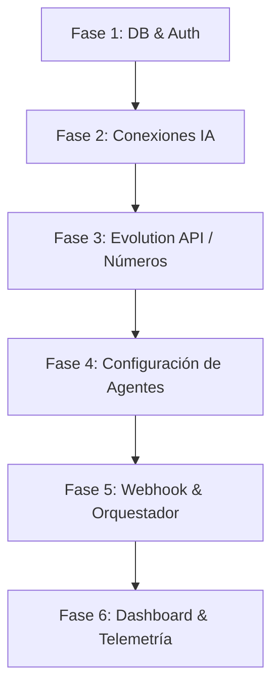

# ZonaWa - MVP Roadmap

## Purpose
Definir las 6 fases de desarrollo incremental del MVP de ZonaWa y sus criterios de aceptación asociados para asegurar la entrega de un sistema estable.

## 1. Fases del Proyecto (Fases del MVP)

El desarrollo del MVP de ZonaWa se estructurará en 6 fases incrementales para asegurar la estabilidad del sistema y facilitar la detección de errores de forma temprana.

---

## 2. Desglose de Fases y Criterios de Aceptación

### Fase 1: Base de Datos y Autenticación (Supabase)
* **Objetivo:** Tener el backend de datos listo y el flujo de usuarios funcional.
* **Tareas:**
  * Crear el proyecto en Supabase.
  * Ejecutar el script SQL de `02_DATABASE_BLUEPRINT.md` en la consola SQL.
  * Configurar e integrar el Auth de Supabase en el cliente React.
  * Diseñar las pantallas de Login, Registro y la persistencia de sesión.
* **Criterio de Aceptación:** Un usuario puede registrarse, iniciar sesión, ser redirigido a las rutas protegidas y la base de datos registra su perfil automáticamente en la tabla `profiles`.

### Fase 2: Módulo de Conexiones IA
* **Objetivo:** Permitir al usuario registrar sus credenciales de OpenAI u otros proveedores de forma segura.
* **Tareas:**
  * Construir la vista `/connections` en React.
  * Implementar el formulario para agregar proveedores y guardar sus credenciales en `ai_connections`.
* **Criterio de Aceptación:** Se pueden guardar y enlistar credenciales de IA, validando que no se expongan en el frontend una vez guardadas.

### Fase 3: Integración de Evolution API (Números de WhatsApp)
* **Objetivo:** Sincronizar teléfonos de WhatsApp y administrar su estado.
* **Tareas:**
  * Configurar una instancia de Evolution API (servidor global).
  * Crear la vista `/numbers` con soporte para tarjetas de números (máximo 6).
  * Desarrollar el modal que solicita el código QR y realizar el polling para renderizarlo.
  * Integrar el interruptor para activar/desactivar bots aplicando la validación de un máximo de 5 bots activos.
* **Criterio de Aceptación:** Escanear un QR conecta el teléfono correctamente. Intentar activar un sexto bot arroja un error y no guarda el estado en Supabase.

### Fase 4: Módulo de Configuración de Agentes
* **Objetivo:** Permitir definir la personalidad y reglas de comportamiento del bot para cada teléfono.
* **Tareas:**
  * Crear la vista `/settings`.
  * Diseñar el formulario para configurar el prompt de sistema, temperatura, tokens límites y disparadores por palabras clave.
  * Guardar los parámetros en la tabla `bot_configurations` y `agents`.
* **Criterio de Aceptación:** Cada número conectado puede tener asignado un agente independiente con su propia configuración de IA y disparadores.

### Fase 5: Webhook y Motor de Orquestación
* **Objetivo:** Lógica core de respuesta automática con memoria.
* **Tareas:**
  * Escribir la Supabase Edge Function que recibe el webhook de Evolution API.
  * Desarrollar la carga de historial reciente (memoria) y el motor de triggers.
  * Integrar la llamada al API de OpenAI usando las credenciales del usuario.
  * Realizar el envío de la respuesta al cliente final por WhatsApp.
  * Registrar el consumo del API y costo en `usage_logs`.
* **Criterio de Aceptación:** Al enviar un mensaje de prueba a un WhatsApp conectado con bot activo, este responde correctamente según su prompt de sistema, mantiene el contexto en los siguientes mensajes y registra el consumo en la base de datos.

### Fase 6: Dashboard y Telemetría
* **Objetivo:** Visualización de analíticas y pulido visual.
* **Tareas:**
  * Conectar las consultas estadísticas de Supabase a los widgets del Dashboard.
  * Diseñar el gráfico de consumo financiero acumulado del mes en USD.
  * Crear el feed de respuestas recientes del bot.
  * Aplicar estilos CSS definitivos en modo oscuro premium (glassmorphism y micro-transiciones).
* **Criterio de Aceptación:** El Dashboard carga inmediatamente los costos financieros correctos de IA consumidos por los bots del usuario activo.

## Requirements
### Requirement: Validación de Criterios de Aceptación del Roadmap
Cada fase del roadmap SHALL cumplimentarse respetando sus criterios de aceptación específicos para asegurar la estabilidad global.

#### Scenario: Completar el desarrollo de la Fase 3
- **WHEN** Se implementa la integración de Evolution API y la visualización de QR
- **THEN** Se verifica que se pueda conectar una cuenta de WhatsApp y que la UI limite el número de bots activos a 5.
